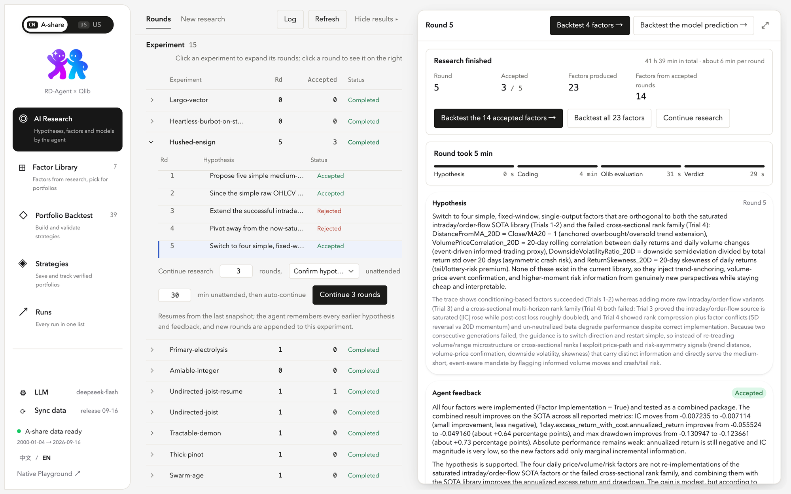
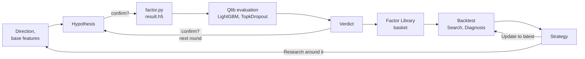
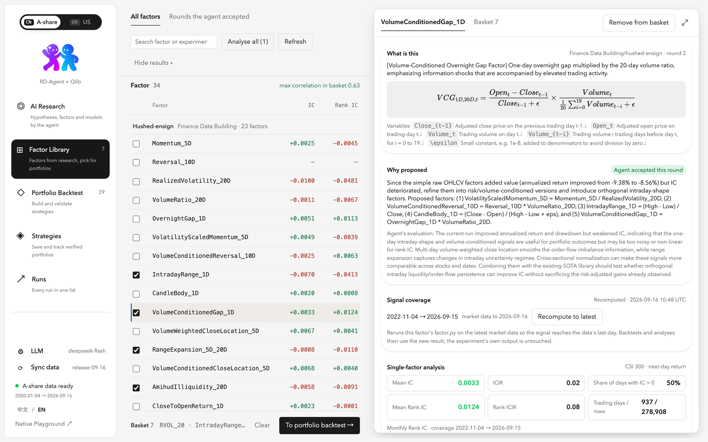
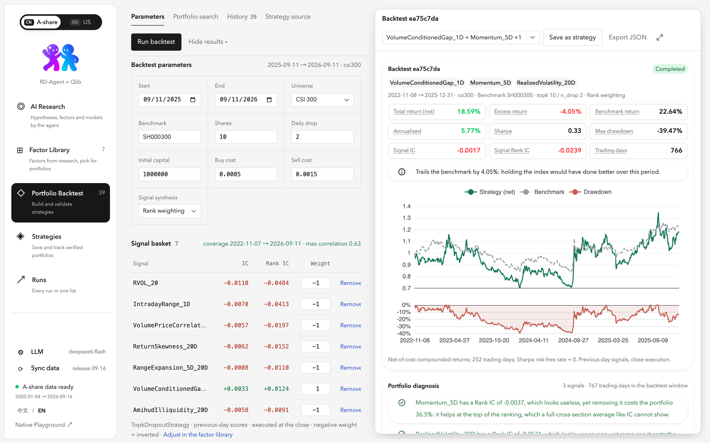
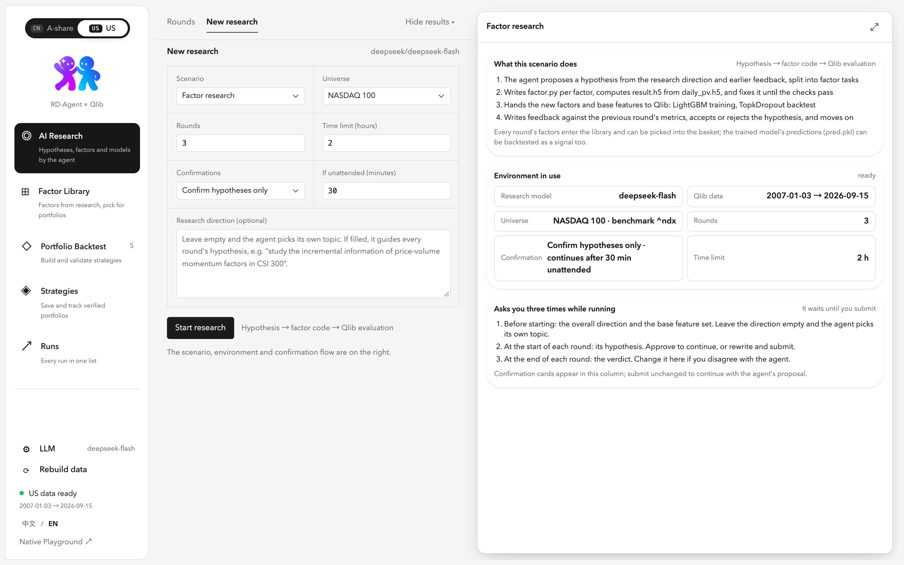

<p align="center">
  <picture>
    <source media="(prefers-color-scheme: dark)" srcset="docs/images/3rdmind-logo-dark.png">
    
  </picture>
</p>

<p align="center">
  <b>English</b> · <a href="README.zh-CN.md">简体中文</a>
</p>

<p align="center">
  A local research studio for quantitative factor investing.<br>
  An LLM agent proposes and tests factors on <a href="https://github.com/microsoft/qlib">Qlib</a>; you curate them into portfolios, backtest, save strategies and track them over time.
</p>

<p align="center">
  <a href="LICENSE"></a>
  
  
  
  
  
</p>

<p align="center">
  <a href="#quick-start">Quick start</a> ·
  <a href="#how-a-research-round-works">How it works</a> ·
  <a href="#screenshots">Screenshots</a> ·
  <a href="#configuration">Configuration</a> ·
  <a href="docs/studio.md">Full documentation</a>
</p>

<p align="center">
  
</p>

## Overview

3rdmind is a three-column workbench that runs on your own machine against your own market data and LLM key. It closes the loop that most agent-based research tools leave open:

1. **Research.** A [RD-Agent](https://github.com/microsoft/RD-Agent) loop proposes a hypothesis, writes `factor.py` for each factor, evaluates the set with a LightGBM model and a TopkDropout backtest in Qlib, and writes a verdict. You decide how much of that you want to confirm by hand.
2. **Curate.** Every factor the agent produced lands in a library with its formula, the agent's reasoning, a single-factor IC analysis and the pairwise correlation of whatever you have picked.
3. **Validate.** A basket of factors (and, optionally, a trained model's predictions) becomes a portfolio: rank-weighted or LightGBM-synthesised, backtested with explicit costs, diagnosed signal by signal, or searched greedily for the subset that holds up out of sample.
4. **Keep.** A validated portfolio is saved as a strategy with its evidence run. It can be recomputed on the latest data, export the next day's book, or seed a new research run that looks for factors orthogonal to it.

Two markets ship as separate workspaces, A-share (CSI 300 and every other Qlib instrument list) and US (NASDAQ-100 built from Yahoo Finance), each with its own data, experiments, factors, backtests and strategies. The interface is available in English and Chinese.

## Contents

- [Features](#features)
- [How a research round works](#how-a-research-round-works)
- [Screenshots](#screenshots)
- [Quick start](#quick-start)
- [Configuration](#configuration)
- [Markets and universes](#markets-and-universes)
- [Backtest methodology](#backtest-methodology)
- [Architecture](#architecture)
- [Development](#development)
- [Limitations](#limitations)
- [Acknowledgements and license](#acknowledgements-and-license)

## Features

### AI Research

- Five scenarios: factor research, model research, joint factor × model, factor extraction from research reports (PDF upload) and model implementation from a paper (PDF or link).
- Research direction, number of rounds, time limit and instrument universe are set per run. A finished factor, model or joint run can be **continued** for more rounds: the loop is restored from its saved session, so the agent keeps its history.
- **Confirmation policy** per run: confirm everything, confirm hypotheses only (default), or fully automatic; each with an unattended timeout after which the agent's own proposal is accepted. Requests that do need you surface as a badge, a banner on every page, a dot in the tab title and, if enabled, desktop notifications with a chime.
- Every round is broken into its four steps (hypothesis, coding, Qlib evaluation, verdict) with durations read off the trace; a live status card shows the current step, elapsed time, an estimate from earlier rounds and the tail of the process log.
- Confirmation cards are forms for the decision at hand: accept or rewrite a hypothesis, accept or flip a verdict, prune the feature list, write an instruction. The raw JSON stays available under an advanced toggle.
- Round and run completions become toasts; a finished run shows a summary card with one-click backtests of the accepted factors and a continue action.

### Factor Library

- Every factor with a `result.h5`, grouped by experiment, with the agent's description, LaTeX formulation, variable glossary and verdict.
- Single-factor analysis against next-day return: daily IC and Rank IC, ICIR, share of positive days, monthly bars and coverage, computed on demand and cached.
- A basket bar shows the maximum pairwise cross-sectional correlation of the selected factors.
- **Recompute to latest** re-runs a factor's `factor.py` on the current market data, so backtests can extend past the research window.

### Portfolio Backtest

- Basket of research factors and model predictions with signed weights (a negative weight inverts a factor), signal synthesis by rank weighting or a LightGBM model, TopkDropout parameters, costs and benchmark.
- Results: net total return, excess return, annualised return, Sharpe, maximum drawdown, signal IC and Rank IC, equity and drawdown curves, holdings, per-instrument P&L, trade timeline and log.
- **Portfolio diagnosis** for multi-signal runs: each signal's IC on the window, its agreement with the final score, pairwise correlation and, on demand, a take-apart pass that backtests every signal alone and the portfolio without each one.
- **Portfolio search**: every candidate alone, forward selection and backward elimination, judged on the first two thirds of the window and reported on the held-out last third next to the everything-in portfolio.
- The exact worker source that produced the numbers is readable from the page.

### Strategies

- Save a completed backtest or a search recommendation by name with its members, weights, parameters and evidence run.
- **Update to latest** recomputes the members and backtests from the evidence start to the last market day, appending a tracking run.
- **Latest signal** exports the newest run's closing book and last-day ranking as CSV or JSON for an execution system.
- **Research around this strategy** starts a factor run with the members as base features, so the agent looks for incremental signals rather than starting over.

### Runs and background jobs

Backtests, searches, diagnoses, factor recomputes, strategy updates, universe exports, research runs, data syncs and data builds are all jobs in one registry with kind, label, status, progress, market and a link back to their page. The rail shows how many are running; completions become toasts and failures stay in the banner until dismissed.

### Data, models and language

- **Sync data** keeps the A-share Qlib snapshot current from [chenditc/investment_data](https://github.com/chenditc/investment_data) releases, on demand or daily at a chosen hour, with a checksum and an atomic directory swap.
- **Rebuild data** builds the NASDAQ-100 directory from Yahoo Finance with monthly membership snapshots.
- **LLM settings** in the rail: DeepSeek, OpenAI, Anthropic, Gemini, DashScope, Moonshot or any OpenAI-compatible endpoint, with a live model list from the provider, a connection test, and keys stored locally with mode 600.
- **中文 / EN** switch at the bottom of the rail.

## How a research round works



The agent owns the inner loop; the studio owns everything outside it. Each `confirm?` is governed by the run's confirmation policy: with *Confirm hypotheses only* you see the hypothesis and nothing else, with *Automatic* the loop runs unattended, and any request left waiting past the timeout is answered with the agent's own proposal and marked as such in the trace.

## Screenshots

<table>
  <tr>
    <td width="50%">
      
      <p align="center"><sub><b>Factor Library.</b> Formula, the agent's reasoning, signal coverage and single-factor IC analysis for one factor; the basket on the left.</sub></p>
    </td>
    <td width="50%">
      
      <p align="center"><sub><b>Portfolio Backtest.</b> Parameters and signal basket on the left; net metrics, equity and drawdown against the benchmark and a per-signal diagnosis on the right.</sub></p>
    </td>
  </tr>
</table>

<p align="center">
  
  <br><sub><b>US workspace.</b> A new factor-research run on NASDAQ 100 with its confirmation policy; the right column explains what the scenario does and when it will ask.</sub>
</p>

## Quick start

### Requirements

- Python 3.10 or newer, with a virtual environment.
- Node.js 22 or newer (to build the front end).
- About 1 GB of disk for the A-share Qlib snapshot.
- An API key for one of the supported LLM providers. Research runs call the model many times per round; a fast, inexpensive model such as DeepSeek's is a reasonable default.
- Optional: a checkout of [microsoft/qlib](https://github.com/microsoft/qlib) placed next to this repository. The worker prefers it over the installed package, and the US data build uses its `scripts/dump_bin.py`.
- For model research (model, factor × model, paper scenarios): PyTorch (`pip install torch`) and an embedding model (see [Configuration](#configuration)). On macOS the pip wheels of PyTorch and LightGBM each bring their own OpenMP runtime and crash Qlib's training when both are loaded; point PyTorch at the Homebrew one so a single runtime is used:

  ```bash
  brew install libomp
  cd .venv/lib/python3.*/site-packages/torch/lib && mv libomp.dylib libomp.dylib.bundled && ln -s /opt/homebrew/opt/libomp/lib/libomp.dylib libomp.dylib
  ```

  Reinstalling PyTorch restores the bundled copy; repeat the link afterwards.

### Install

```bash
git clone https://github.com/mailbobg/3rdmind.git
cd 3rdmind
python -m venv .venv && source .venv/bin/activate
pip install -e .            # installs RD-Agent, pyqlib and lightgbm from requirements.txt
cd studio && npm install && npm run build && cd ..
```

`npm run build` writes the production front end to `git_ignore_folder/static/app/`, which the backend serves.

### Configure the research environment

RD-Agent reads its settings from an env file. Create `git_ignore_folder/studio.env` (any path works; point `STUDIO_ENV_FILE` at it) with the execution settings below. LLM credentials can go here as well, or be entered later in the studio's **LLM** panel, which overrides the file.

```dotenv
# Run generated factor code in this virtual environment instead of Docker
FACTOR_COSTEER_ENV_TYPE=venv
MODEL_COSTEER_ENV_TYPE=venv
FACTOR_COSTEER_PYTHON_BIN=/absolute/path/to/.venv/bin/python

# Windows for the agent's Qlib evaluation; keep them inside your data's coverage
QLIB_FACTOR_TRAIN_START=2023-01-01
QLIB_FACTOR_TRAIN_END=2023-12-31
QLIB_FACTOR_VALID_START=2024-01-01
QLIB_FACTOR_VALID_END=2024-06-30
QLIB_FACTOR_TEST_START=2024-07-01
QLIB_FACTOR_TEST_END=2025-12-31

# Optional: LLM here instead of in the UI
# CHAT_MODEL=deepseek/deepseek-chat
# DEEPSEEK_API_KEY=...
```

The studio sets the market-specific variables itself for every run (provider directory, region, benchmark, price limit, commissions, factor input data), so nothing about the universe belongs in this file.

### Start

```bash
STUDIO_ENV_FILE=git_ignore_folder/studio.env UI_LOAD_LEGACY_PICKLE_TRACES=true sh scripts/start-studio.sh
```

Open <http://127.0.0.1:19899/app/>. Then, in the studio:

1. **Sync data** in the rail downloads the A-share Qlib snapshot into `~/.qlib/qlib_data/cn_data` (or `QLIB_PROVIDER_URI`). For the US workspace, switch to **US** and use **Rebuild data**.
2. **LLM** in the rail: pick a provider, paste a key, load the model list, run the connection test, save.
3. **AI Research → New research**: choose a scenario and universe, set rounds and the confirmation policy, start. The first run on a universe exports its factor input data once; the studio waits and retries by itself.
4. When a hypothesis needs your decision, a banner appears on every page. Approve, rewrite, or let the timeout accept the agent's proposal.
5. After the run, open **Factor Library**, pick factors into the basket, and go to **Portfolio Backtest**.

`UI_LOAD_LEGACY_PICKLE_TRACES=true` makes experiments from earlier server processes visible; without it only runs started by the current process are listed.

## Configuration

| Variable | Default | Purpose |
| --- | --- | --- |
| `QLIB_PROVIDER_URI` | `~/.qlib/qlib_data/cn_data` | A-share Qlib data directory. Sibling directories with a `studio-universe.json` become additional markets. |
| `STUDIO_ENV_FILE` | `git_ignore_folder/deepseek.env` | Env file loaded by `scripts/start-studio.sh` before the server starts. |
| `STUDIO_PYTHON` | current interpreter | Python used for backtest, analysis, refresh and universe-export workers, if Qlib lives in a different environment. |
| `STUDIO_PORT` | `19899` | Backend port; the front end is served at `/app/`. |
| `UI_LOAD_LEGACY_PICKLE_TRACES` | unset | `true` loads finished experiments from the trace folder at start-up. |
| `GITHUB_TOKEN` / `GH_TOKEN` | unset | Raises the GitHub API rate limit for the data-sync release check. |
| `QLIB_{FACTOR,MODEL,QUANT}_N_JOBS` | `20` (`0` on macOS runs started by the studio) | DataLoader worker processes of Qlib's PyTorch models; forked workers crash on macOS. |

The embedding model for RD-Agent's knowledge graph is set in the same panel as the chat model (LLM in the rail, bottom section): OpenAI, Gemini, DashScope, any OpenAI-compatible endpoint (SiliconFlow's `BAAI/bge-m3` is free) or a local Ollama. It reaches runs as `EMBEDDING_MODEL`; chat-only providers such as DeepSeek cannot be used for it.

Studio state is written under the RD-Agent trace folder: `studio_backtests/<id>/`, `studio_searches/`, `studio_strategies/`, `studio_refresh/`, and `studio_data/` (LLM settings, sync settings, per-universe factor input data, instrument names). LLM keys are stored with mode 600 and are never echoed back beyond their last four characters.

## Markets and universes

Markets are workspaces. The switch at the top of the rail changes the whole studio: experiments, factor library, basket, backtests, searches, strategies, runs and data status are all scoped to the selected market, while LLM settings and layout are shared.

Universes come from a registry. The default Qlib directory contributes every `instruments/*.txt` it holds; any sibling directory with a `studio-universe.json` contributes its own markets, region and benchmark:

```json
{"region": "us", "label": "US", "benchmark": "^ndx", "markets": {"nasdaq100": "NASDAQ 100"}}
```

Region rules reach both RD-Agent's Qlib templates and the studio's backtest form:

| | A-share (`cn`) | US (`us`) |
| --- | --- | --- |
| Price limit | 9.5 % | none |
| Buy / sell cost | 0.05 % / 0.15 % | 0.01 % / 0.01 % |
| Minimum commission | 5 | 1 |
| Benchmark | `SH000300` (CSI 300) | `^ndx` |
| LightGBM L1 / L2 in the agent's evaluation | 205.7 / 581 | scaled by universe size ÷ 300 |

The LightGBM penalties tuned for CSI 300 make the evaluation model predict a constant on a 100-name universe; scaling them by size is what lets the agent's verdicts mean anything on NASDAQ 100. RD-Agent's result cache is keyed by market, and the report-extraction prompts name the market too.

The NASDAQ-100 build (`scripts/build-us-data.py`) takes monthly membership snapshots from Nasdaq's index site from 2008 onward, downloads every ever-member plus `^NDX` with `yahooquery`, and runs Qlib's Yahoo normalisation and `dump_bin`. Tickers that were delisted or acquired are no longer on Yahoo, so the history carries survivorship bias before roughly 2020; the current members are complete.

## Backtest methodology

- **Signals.** Each selected factor's `result.h5` (or a model's `pred.pkl`) is cross-sectionally percentile-ranked per day. With *rank weighting* the score is the weighted sum divided by the sum of absolute weights; with *LightGBM* a model is trained on the ranked signals against the label `Ref($close, -2)/Ref($close, -1) - 1`, z-scored per day, with early stopping on the validation window, and its prediction is the score. Training, validation and backtest windows must not overlap.
- **Execution.** Qlib's `TopkDropoutStrategy` holds the top *k* names, replaces *n_drop* per day, uses the previous day's scores and trades at the current day's close, with the region's costs, minimum commission and price limit.
- **Metrics.** Total return and drawdown are compounded, net of cost. Annualisation uses 252 trading days. Sharpe uses net daily returns and a zero risk-free rate. Signal IC and Rank IC are the mean daily correlation of the final score with the label over the backtest window. RD-Agent's own metrics keep their original names and are shown separately, so annualised excess return is never confused with total return.
- **Integrity.** Missing data is reported, never back-filled with demo results. A window past a factor's coverage is rejected. Duplicate factor names in one basket are rejected before the run. An end date on the data's last calendar day is moved back one day, because the strategy needs the following day's prices, and the note is shown with the result.

## Architecture

```
rdagent/log/server/          Flask backend (RD-Agent's log server plus the /studio blueprint)
  app.py                     research runs, confirmation policy and watcher, resume, traces
  studio.py                  /studio/* routes: experiments, factors, backtests, searches, strategies, jobs, LLM, data
  studio_worker.py           Qlib backtest / diagnosis / search worker (separate process)
  studio_analysis.py         single-factor IC analysis
  studio_refresh.py          recompute a factor on the latest data
  studio_universe.py         export a universe's factor input data
  studio_markets.py          universe registry, regions and exchange rules
  studio_jobs.py             background job registry
  studio_llm.py              provider settings, model lists, connection test
  studio_sync.py             A-share data sync
studio/                      React 19 + HeroUI v3 + Tailwind CSS v4 front end (Vite)
  src/pages/                 Research, Factors, Backtest, Strategies, Runs
  src/components/            shell, market switch, progress, attention bar, toasts, settings panels
  src/hooks/                 trace polling, jobs, attention, storage, progress
  src/i18n.ts, i18n.en.ts    English dictionary keyed by the Chinese source strings
rdagent/scenarios/qlib/      RD-Agent's Qlib scenario with region, provider and cost templating
scripts/                     start-studio.sh, build-us-data.py
docs/studio.md               full documentation
```

The backend exposes the studio's API under `/studio/`: `experiments`, `rounds`, `factors` (with `analysis`, `coverage`, `correlation`, `refresh`), `backtests` (with `diagnose`), `searches`, `strategies` (with `update`, `signal`), `jobs`, `attention`, `recent`, `trace-tail`, `regions`, `environment`, `llm` (with `models`, `test`) and `data/sync`, `data/build`. Every list endpoint accepts `?region=`. Research control uses RD-Agent's native `/trace`, `/control`, `/resume`, `/upload` and `/user_interaction/submit`.

## Development

```bash
# front end with hot reload; proxies the API to port 19899
cd studio && npm run dev            # http://127.0.0.1:8081/app/

# tests
pytest test/log/server/test_studio.py    # backend, offline
cd studio && npm test                    # vitest
```

Adding a UI string: write it in Chinese in the component, wrap it in `t()`, and add its English to `src/i18n.en.ts`. A missing entry falls back to the Chinese text and is logged in development.

## Limitations

- The quality of hypotheses and code depends on the model you configure; the studio does not make a weak model produce good factors.
- Backtests are historical simulations with simplified execution. They are not investment advice and nothing here places orders.
- The US data has survivorship bias before about 2020 and no automatic update yet.
- Research and backtest workers finish on their own; there is no cancellation control for a running Qlib job.
- The Data Science scenario of RD-Agent is not part of the studio.

## Acknowledgements and license

3rdmind is released under the [Apache License 2.0](LICENSE).

The research engine is [microsoft/RD-Agent](https://github.com/microsoft/RD-Agent) (MIT); its copyright notice is preserved in [LICENSE.RD-Agent](LICENSE.RD-Agent). Backtests run on [microsoft/qlib](https://github.com/microsoft/qlib) (MIT). The A-share data comes from [chenditc/investment_data](https://github.com/chenditc/investment_data); the US data from Yahoo Finance via [yahooquery](https://github.com/dpguthrie/yahooquery). The front end uses [HeroUI](https://heroui.com) and [Tailwind CSS](https://tailwindcss.com).
