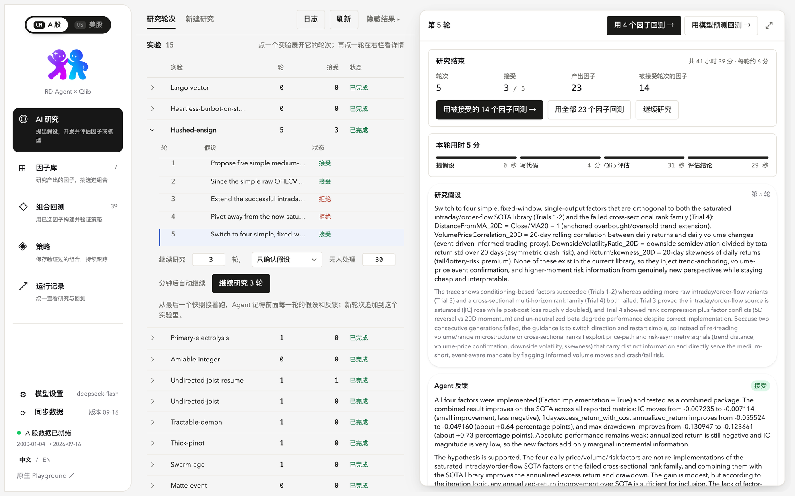
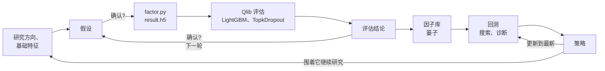
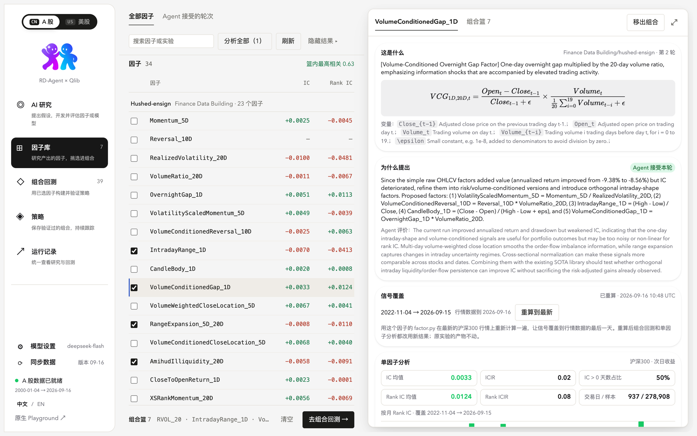
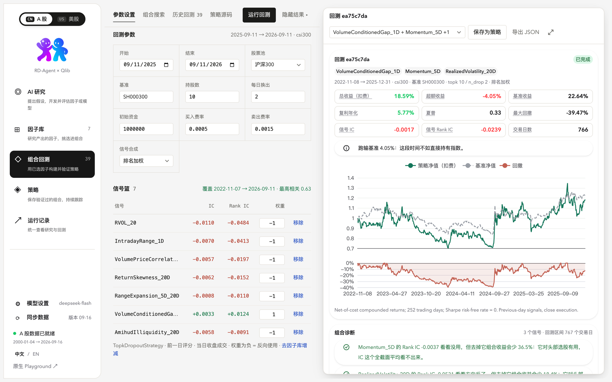
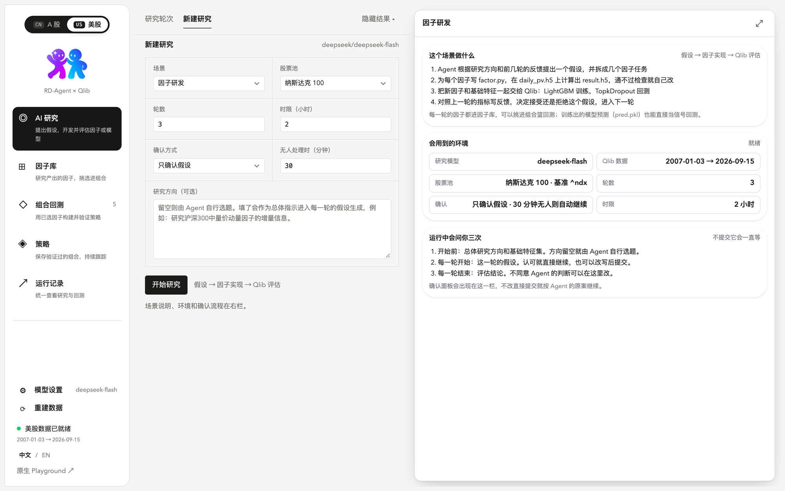

<p align="center">
  <picture>
    <source media="(prefers-color-scheme: dark)" srcset="docs/images/3rdmind-logo-dark.png">
    
  </picture>
</p>

<p align="center">
  <a href="README.md">English</a> · <b>简体中文</b>
</p>

<p align="center">
  本地运行的量化因子研究工作台。<br>
  LLM Agent 在 <a href="https://github.com/microsoft/qlib">Qlib</a> 上提出并验证因子；你负责挑选、组合、回测，保存为策略并持续跟踪。
</p>

<p align="center">
  <a href="LICENSE"></a>
  
  
  
  
  
</p>

<p align="center">
  <a href="#快速开始">快速开始</a> ·
  <a href="#一轮研究是怎么跑的">工作原理</a> ·
  <a href="#界面截图">界面截图</a> ·
  <a href="#配置">配置</a> ·
  <a href="docs/studio.md">完整文档</a>
</p>

<p align="center">
  
</p>

## 概述

3rdmind 是一个三栏式工作台，在你自己的机器上运行，用你自己的行情数据和模型密钥。它把多数 Agent 研究工具留下的缺口补上，形成完整的闭环：

1. **研究。** 一个 [RD-Agent](https://github.com/microsoft/RD-Agent) 循环提出假设，为每个因子写出 `factor.py`，在 Qlib 里用 LightGBM 模型和 TopkDropout 回测评估整组因子，再写出评估结论。哪些环节要经你确认，由你决定。
2. **挑选。** Agent 产出的每个因子都进入因子库，带公式、Agent 的推理、单因子 IC 分析，以及你已选因子之间的两两相关性。
3. **验证。** 一篓因子（也可以加上训练好的模型预测）构成一个组合：按排名加权或用 LightGBM 合成信号，带明确成本回测，逐个信号诊断，或者用贪心搜索找出样本外仍然站得住的子集。
4. **保留。** 验证过的组合以名字保存为策略，附带作为证据的那次回测。它可以在最新数据上重算，导出下一交易日的持仓，或者作为新一轮研究的起点，让 Agent 去找与它正交的因子。

A 股（沪深 300 及 Qlib 数据里的任何股票池）和美股（用 Yahoo Finance 构建的纳斯达克 100）是两个独立的工作区，各自有数据、实验、因子、回测和策略。界面支持中文和英文。

## 目录

- [功能](#功能)
- [一轮研究是怎么跑的](#一轮研究是怎么跑的)
- [界面截图](#界面截图)
- [快速开始](#快速开始)
- [配置](#配置)
- [市场与股票池](#市场与股票池)
- [回测方法](#回测方法)
- [架构](#架构)
- [开发](#开发)
- [局限](#局限)
- [致谢与许可](#致谢与许可)

## 功能

### AI 研究

- 五种场景：因子研发、模型研发、因子 × 模型联合、研报因子提取（上传 PDF）、论文模型实现（PDF 或链接）。
- 研究方向、轮数、时间上限和股票池按每次运行设置。已结束的因子、模型或联合实验可以**继续研究**若干轮：循环从保存的会话快照恢复，Agent 记得之前的全部历史。
- 每次运行带一个**确认策略**：全部确认、只确认假设（默认）或全自动，都配一个无人处理的超时时间，到时按 Agent 自己的提案继续。真正需要你的请求会以角标、每页顶部的横幅、标签页标题上的圆点出现，打开后还有桌面通知和提示音。
- 每轮拆成四步（提假设、写代码、Qlib 评估、评估结论），时长从 trace 时间戳读出；运行中的实验有一张状态卡，显示当前步骤、已用时长、根据前几轮的估计，以及进程日志的尾部。
- 确认卡片是针对当下决定的表单：接受或改写假设、接受或翻转结论、删减特征列表、写指令。原始 JSON 收在"高级"里。
- 轮次和运行结束会弹出提示；结束的运行显示一张摘要卡，可一键回测被接受的因子或继续研究。

### 因子库

- 每个产出了 `result.h5` 的因子，按实验分组，带 Agent 的描述、LaTeX 公式、变量说明和评估结论。
- 单因子分析（相对次日收益）：每日 IC 与 Rank IC、ICIR、正收益天数占比、月度柱状图和覆盖范围，按需计算并缓存。
- 篓子栏显示已选因子之间的最大两两横截面相关性。
- **重算到最新**在当前行情数据上重跑因子的 `factor.py`，回测才能越过研究窗口。

### 组合回测

- 篓子里是研究因子和模型预测，权重带符号（负权重表示反向），信号合成可选排名加权或 LightGBM 模型，加上 TopkDropout 参数、成本和基准。
- 结果：净总收益、超额收益、年化收益、夏普、最大回撤、信号 IC 与 Rank IC、净值和回撤曲线、持仓、逐股盈亏、交易时间线和日志。
- **组合诊断**（多信号时）：每个信号在窗口内的 IC、与最终得分的一致度、两两相关性；按需做一轮拆解，把每个信号单独回测，再把组合去掉它回测一次。
- **组合搜索**：每个候选单独跑一遍，再做前向选择和后向剔除，以窗口的前三分之二评判，在留出的后三分之一上与"全部放进去"的组合并排报告。
- 产生这些数字的 worker 源码可以在页面上直接读。

### 策略

- 把一次完成的回测或一条搜索建议以名字保存，记录成员、权重、参数和作为证据的那次运行。
- **更新到最新**重算成员，并从证据起点回测到最近一个交易日，追加一次跟踪运行。
- **最新信号**把最近一次运行的收盘持仓和最后一天的排名导出为 CSV 或 JSON，交给执行系统。
- **围着这个策略继续研究**以成员因子作为基础特征启动一次因子研究，让 Agent 找增量信号，而不是从零开始。

### 运行记录与后台任务

回测、搜索、诊断、因子重算、策略更新、股票池数据导出、研究运行、数据同步和数据重建，都是同一个注册表里的任务，带类型、名称、状态、进度、市场和回到所属页面的链接。左栏显示有几个在跑；完成时弹出提示，失败的留在横幅里直到手动关闭。

### 数据、模型与语言

- **同步数据**从 [chenditc/investment_data](https://github.com/chenditc/investment_data) 的 release 更新 A 股 Qlib 快照，可手动，也可每天定时，带校验和和原子目录替换。
- **重建数据**用 Yahoo Finance 和逐月成分快照构建纳斯达克 100 数据目录。
- **模型设置**在左栏：DeepSeek、OpenAI、Anthropic、Gemini、阿里云百炼、Moonshot 或任何 OpenAI 兼容接口，可从服务商拉取实时模型列表、测试连接，密钥以 600 权限保存在本地。
- 左栏底部有 **中文 / EN** 切换。

## 一轮研究是怎么跑的



Agent 负责内环，工作台负责内环之外的一切。每个"确认?"由这次运行的确认策略决定：选"只确认假设"时你只会看到假设，选"全自动"时整个循环无人值守；任何等待超过时限的请求都按 Agent 自己的提案作答，并在 trace 里标明。

## 界面截图

<table>
  <tr>
    <td width="50%">
      
      <p align="center"><sub><b>因子库。</b>一个因子的公式、Agent 的推理、信号覆盖范围和单因子 IC 分析；左侧是篓子。</sub></p>
    </td>
    <td width="50%">
      
      <p align="center"><sub><b>组合回测。</b>左侧是参数和信号篓子；右侧是净指标、对比基准的净值和回撤曲线，以及逐信号诊断。</sub></p>
    </td>
  </tr>
</table>

<p align="center">
  
  <br><sub><b>美股工作区。</b>在纳斯达克 100 上新建一次因子研究并设定确认策略；右栏解释这个场景做什么、什么时候会来问你。</sub>
</p>

## 快速开始

### 环境要求

- Python 3.10 或更新，建议使用虚拟环境。
- Node.js 22 或更新（构建前端）。
- 约 1 GB 磁盘空间存放 A 股 Qlib 快照。
- 一个受支持的 LLM 服务商的 API key。研究运行每轮会调用模型很多次，DeepSeek 这类快而便宜的模型是合理的默认选择。
- 可选：把 [microsoft/qlib](https://github.com/microsoft/qlib) 的源码检出放在本仓库旁边。worker 会优先使用它而不是已安装的包，美股数据构建也用到它的 `scripts/dump_bin.py`。
- 模型研发类场景（模型研发、因子 × 模型联合、论文模型实现）另需 PyTorch（`pip install torch`）和一个嵌入模型（见[配置](#配置)）。macOS 上 pip 装的 PyTorch 和 LightGBM 各自带一份 OpenMP 运行时，两份同时加载会让 Qlib 训练段错误；把 PyTorch 指向 Homebrew 那份，整个进程只用一份：

  ```bash
  brew install libomp
  cd .venv/lib/python3.*/site-packages/torch/lib && mv libomp.dylib libomp.dylib.bundled && ln -s /opt/homebrew/opt/libomp/lib/libomp.dylib libomp.dylib
  ```

  重装 PyTorch 会把自带的那份放回来，之后再做一次软链接。

### 安装

```bash
git clone https://github.com/mailbobg/3rdmind.git
cd 3rdmind
python -m venv .venv && source .venv/bin/activate
pip install -e .            # 按 requirements.txt 安装 RD-Agent、pyqlib 和 lightgbm
cd studio && npm install && npm run build && cd ..
```

`npm run build` 把生产版前端写到 `git_ignore_folder/static/app/`，由后端直接提供。

### 配置研究环境

RD-Agent 从一个 env 文件读取设置。新建 `git_ignore_folder/studio.env`（路径随意，用 `STUDIO_ENV_FILE` 指向它），写入下面的执行设置。LLM 凭据也可以写在这里，或者稍后在工作台的**模型设置**面板里填，面板里的设置优先于文件。

```dotenv
# 在这个虚拟环境里运行生成的因子代码，而不是 Docker
FACTOR_COSTEER_ENV_TYPE=venv
MODEL_COSTEER_ENV_TYPE=venv
FACTOR_COSTEER_PYTHON_BIN=/absolute/path/to/.venv/bin/python

# Agent 做 Qlib 评估的时间窗口；保持在你的数据覆盖范围内
QLIB_FACTOR_TRAIN_START=2023-01-01
QLIB_FACTOR_TRAIN_END=2023-12-31
QLIB_FACTOR_VALID_START=2024-01-01
QLIB_FACTOR_VALID_END=2024-06-30
QLIB_FACTOR_TEST_START=2024-07-01
QLIB_FACTOR_TEST_END=2025-12-31

# 可选：LLM 写在这里而不是界面里
# CHAT_MODEL=deepseek/deepseek-chat
# DEEPSEEK_API_KEY=...
```

与市场相关的变量（数据目录、地区、基准、涨跌停、佣金、因子输入数据）由工作台在每次运行时自行设置，这个文件里不需要写任何与股票池有关的内容。

### 启动

```bash
STUDIO_ENV_FILE=git_ignore_folder/studio.env UI_LOAD_LEGACY_PICKLE_TRACES=true sh scripts/start-studio.sh
```

打开 <http://127.0.0.1:19899/app/>，然后在工作台里：

1. 左栏**同步数据**把 A 股 Qlib 快照下载到 `~/.qlib/qlib_data/cn_data`（或 `QLIB_PROVIDER_URI`）。美股工作区切到 **美股** 后用**重建数据**。
2. 左栏**模型设置**：选服务商、填 key、拉取模型列表、测试连接、保存。
3. **AI 研究 → 新建研究**：选场景和股票池，设轮数和确认策略，开始。某个股票池的第一次运行会先导出一次因子输入数据，工作台会自己等待并重试。
4. 假设需要你决定时，每一页顶部都会出现横幅。接受、改写，或者等超时按 Agent 的提案继续。
5. 运行结束后打开**因子库**，把因子挑进篓子，进入**组合回测**。

`UI_LOAD_LEGACY_PICKLE_TRACES=true` 让之前的服务进程跑过的实验也能显示；不设则只列出当前进程启动的运行。

## 配置

| 变量 | 默认值 | 用途 |
| --- | --- | --- |
| `QLIB_PROVIDER_URI` | `~/.qlib/qlib_data/cn_data` | A 股 Qlib 数据目录。带 `studio-universe.json` 的同级目录会成为额外的市场。 |
| `STUDIO_ENV_FILE` | `git_ignore_folder/deepseek.env` | `scripts/start-studio.sh` 在服务启动前加载的 env 文件。 |
| `STUDIO_PYTHON` | 当前解释器 | 回测、分析、重算和股票池导出 worker 使用的 Python，用于 Qlib 装在另一个环境的情况。 |
| `STUDIO_PORT` | `19899` | 后端端口；前端在 `/app/` 下。 |
| `UI_LOAD_LEGACY_PICKLE_TRACES` | 未设置 | `true` 时启动即从 trace 目录加载已结束的实验。 |
| `GITHUB_TOKEN` / `GH_TOKEN` | 未设置 | 提高数据同步检查 release 时的 GitHub API 限额。 |
| `QLIB_{FACTOR,MODEL,QUANT}_N_JOBS` | `20`（工作台在 macOS 上启动的运行为 `0`） | Qlib PyTorch 模型的 DataLoader 子进程数；macOS 上 fork 的子进程会崩。 |

RD-Agent 知识图谱用的嵌入模型和聊天模型在同一个面板里设置（左栏"模型设置"底部）：OpenAI、Gemini、阿里云百炼、任何 OpenAI 兼容接口（硅基流动的 `BAAI/bge-m3` 免费）或本机 Ollama。它以 `EMBEDDING_MODEL` 传给研究进程；DeepSeek 这类只有聊天接口的服务商不能用在这里。

工作台的状态写在 RD-Agent 的 trace 目录下：`studio_backtests/<id>/`、`studio_searches/`、`studio_strategies/`、`studio_refresh/` 和 `studio_data/`（模型设置、同步设置、各股票池的因子输入数据、股票名称）。LLM 密钥以 600 权限保存，回显时只给最后四位。

## 市场与股票池

市场即工作区。左栏顶部的切换改变整个工作台：实验、因子库、篓子、回测、搜索、策略、运行记录和数据状态都只属于当前市场；模型设置和布局是共享的。

股票池来自一个注册表。默认 Qlib 目录贡献它所有的 `instruments/*.txt`；任何带 `studio-universe.json` 的同级目录贡献自己的市场、地区和基准：

```json
{"region": "us", "label": "美股", "benchmark": "^ndx", "markets": {"nasdaq100": "纳斯达克 100"}}
```

地区规则同时进入 RD-Agent 的 Qlib 模板和工作台的回测表单：

| | A 股（`cn`） | 美股（`us`） |
| --- | --- | --- |
| 涨跌停 | 9.5 % | 无 |
| 买入 / 卖出成本 | 0.05 % / 0.15 % | 0.01 % / 0.01 % |
| 最低佣金 | 5 | 1 |
| 基准 | `SH000300`（沪深 300） | `^ndx` |
| Agent 评估用的 LightGBM L1 / L2 | 205.7 / 581 | 按股票池规模 ÷ 300 缩放 |

为沪深 300 调好的 LightGBM 惩罚项在 100 只股票的池子上会让评估模型输出常数；按规模缩放之后，Agent 在纳斯达克 100 上的结论才有意义。RD-Agent 的结果缓存以市场为键，研报提取的提示词也会写明市场。

纳斯达克 100 数据（`scripts/build-us-data.py`）从 Nasdaq 指数站取 2008 年起的逐月成分快照，用 `yahooquery` 下载所有曾经的成分股和 `^NDX`，再跑 Qlib 的 Yahoo 归一化和 `dump_bin`。已退市或被收购的股票在 Yahoo 上已经没有了，所以大约 2020 年之前的历史带有幸存者偏差；当前成分是完整的。

## 回测方法

- **信号。** 每个已选因子的 `result.h5`（或模型的 `pred.pkl`）每天做横截面百分位排名。*排名加权*下，得分是加权和除以权重绝对值之和；*LightGBM* 下，用排名后的信号训练模型，标签是 `Ref($close, -2)/Ref($close, -1) - 1` 按日 z-score，在验证窗口上早停，用模型预测作为得分。训练、验证和回测窗口不能重叠。
- **执行。** Qlib 的 `TopkDropoutStrategy` 持有前 *k* 只，每天换掉 *n_drop* 只，用前一日得分、当日收盘价成交，按地区的成本、最低佣金和涨跌停执行。
- **指标。** 总收益和回撤为复利计算、扣除成本。年化按 252 个交易日。夏普用净日收益，无风险利率取零。信号 IC 与 Rank IC 是回测窗口内最终得分与标签的日均相关性。RD-Agent 自己的指标保留原名并单独展示，年化超额收益不会和总收益混淆。
- **完整性。** 缺失的数据会报错，不会用演示结果补上。超出因子覆盖范围的窗口会被拒绝。同一篓子里重复的因子名在运行前就被拒绝。结束日落在数据最后一个交易日上时会往前挪一天（策略需要下一天的价格），并在结果里附上说明。

## 架构

```
rdagent/log/server/          Flask 后端（RD-Agent 的 log server 加 /studio 蓝图）
  app.py                     研究运行、确认策略与看守线程、继续研究、trace
  studio.py                  /studio/* 路由：实验、因子、回测、搜索、策略、任务、LLM、数据
  studio_worker.py           Qlib 回测 / 诊断 / 搜索 worker（独立进程）
  studio_analysis.py         单因子 IC 分析
  studio_refresh.py          在最新数据上重算因子
  studio_universe.py         导出股票池的因子输入数据
  studio_markets.py          股票池注册表、地区与交易规则
  studio_jobs.py             后台任务注册表
  studio_llm.py              服务商设置、模型列表、连接测试
  studio_sync.py             A 股数据同步
studio/                      React 19 + HeroUI v3 + Tailwind CSS v4 前端（Vite）
  src/pages/                 研究、因子库、回测、策略、运行记录
  src/components/            外壳、市场切换、进度、注意力横幅、提示、设置面板
  src/hooks/                 trace 轮询、任务、注意力、存储、进度
  src/i18n.ts, i18n.en.ts    以中文原文为键的英文字典
rdagent/scenarios/qlib/      RD-Agent 的 Qlib 场景，带地区、数据目录和成本模板
scripts/                     start-studio.sh、build-us-data.py
docs/studio.md               完整文档
```

后端在 `/studio/` 下提供工作台接口：`experiments`、`rounds`、`factors`（含 `analysis`、`coverage`、`correlation`、`refresh`）、`backtests`（含 `diagnose`）、`searches`、`strategies`（含 `update`、`signal`）、`jobs`、`attention`、`recent`、`trace-tail`、`regions`、`environment`、`llm`（含 `models`、`test`）以及 `data/sync`、`data/build`。所有列表接口都接受 `?region=`。研究控制走 RD-Agent 原生的 `/trace`、`/control`、`/resume`、`/upload` 和 `/user_interaction/submit`。

## 开发

```bash
# 前端热更新；接口代理到 19899 端口
cd studio && npm run dev            # http://127.0.0.1:8081/app/

# 测试
pytest test/log/server/test_studio.py    # 后端，离线
cd studio && npm test                    # vitest
```

新增界面文字：在组件里写中文，用 `t()` 包起来，再把英文加进 `src/i18n.en.ts`。字典里缺的条目会回退显示中文，开发模式下会在控制台提示。

## 局限

- 假设和代码的质量取决于你配置的模型；工作台不能让弱模型产出好因子。
- 回测是简化执行的历史模拟，不构成投资建议，这里也没有任何下单的功能。
- 美股数据在 2020 年之前带有幸存者偏差，目前没有自动更新。
- 研究和回测 worker 会自行跑完，运行中的 Qlib 任务没有取消按钮。
- RD-Agent 的 Data Science 场景不在工作台范围内。

## 致谢与许可

3rdmind 以 [Apache License 2.0](LICENSE) 发布。

研究引擎是 [microsoft/RD-Agent](https://github.com/microsoft/RD-Agent)（MIT），其版权声明保留在 [LICENSE.RD-Agent](LICENSE.RD-Agent)。回测运行在 [microsoft/qlib](https://github.com/microsoft/qlib)（MIT）上。A 股数据来自 [chenditc/investment_data](https://github.com/chenditc/investment_data)；美股数据经 [yahooquery](https://github.com/dpguthrie/yahooquery) 取自 Yahoo Finance。前端使用 [HeroUI](https://heroui.com) 和 [Tailwind CSS](https://tailwindcss.com)。
